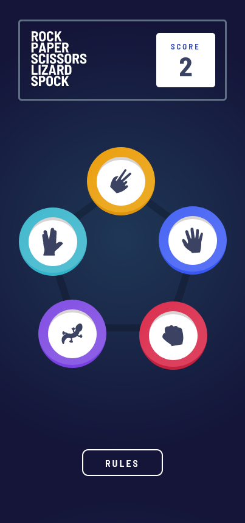
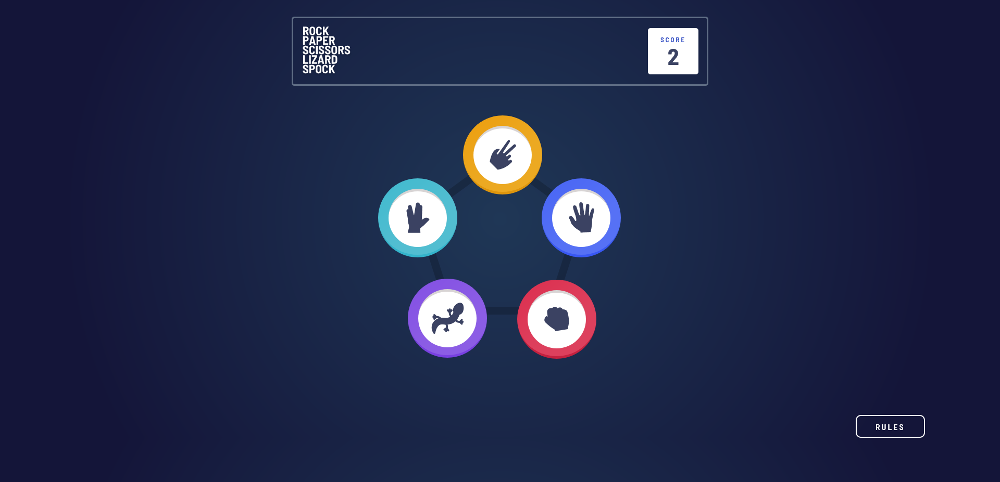

# Frontend Mentor - Rock, Paper, Scissors solution

This is a solution to the [Rock, Paper, Scissors challenge on Frontend Mentor](https://www.frontendmentor.io/challenges/rock-paper-scissors-game-pTgwgvgH). Frontend Mentor challenges help you improve your coding skills by building realistic projects.

## Table of contents

- [Overview](#overview)
  - [The challenge](#the-challenge)
  - [Screenshot](#screenshot)
  - [Links](#links)
- [My process](#my-process)
  - [Built with](#built-with)
  - [What I learned](#what-i-learned)
  - [Continued development](#continued-development)
  - [Useful resources](#useful-resources)
- [Author](#author)
- [Acknowledgments](#acknowledgments)

## Overview

### The challenge

Users should be able to:

- View the optimal layout for the game depending on their device's screen size
- Play Rock, Paper, Scissors against the computer
- Maintain the state of the score after refreshing the browser _(optional)_
- **Bonus**: Play Rock, Paper, Scissors, Lizard, Spock against the computer _(optional)_

### Screenshot




### Links

- Solution URL: [Rock-Paper-Scissors-Game](https://rock-paper-scissors-game-kas.netlify.app/)

## My process

### Built with

- Semantic HTML5 markup
- Sass
- Flexbox
- CSS Grid
- Mobile-first workflow
- [React](https://reactjs.org/)
- [React Router](https://reactrouter.com/)
- [Framer Motion](https://www.framer.com/motion/)

### What I learned

This was without doubt the most complex challenge I've done but not in the way I had imagined when started it. The "game logic" itself was fairly easy to figure out. First I used a switch statement with nested if else statements, then refactored this code to make it easier to read and understand. The strings that represent the user's and the house's choices are concatenated, then the ones that lead to the same result are grouped together, like so:

```
switch (userChoice + houseChoice) {
      case "rockrock":
      case "paperpaper":
      case "scissorsscissors":
      case "lizardlizard":
      case "spockpock":
        setResult("DRAW");
        break;
      case "rockpaper":
      case "rockspock":
      case "paperscissors":
      case "paperlizard":
      case "scissorsrock":
      case "scissorspock":
      case "lizardrock":
      case "lizardscissors":
      case "spocklizard":
      case "spockpaper":
        setResult("HOUSE WINS");
        break;
      case "rockscissors":
      case "rocklizard":
      case "paperrock":
      case "paperspock":
      case "scissorspaper":
      case "scissorslizard":
      case "lizardspock":
      case "lizardpaper":
      case "spockscissors":
      case "spockrock":
        setResult("USER WINS");
        setScore(score + 1);
        break;
      default:
        console.log("Something went wrong.")
    }
```

While I realise this isn't scalable (spelling errors could occur and probably aren't very pleasant to bedug), I decided it's alright for this use case, as it's pretty unlikely that anyone's going to add more rules to a rock-paper-scissors game. Readability won.

### Continued development

I have some second-thoughts about the choice of the game button element here. While it's named button - and I did use a button element for it -, I've been wondering if radio inputs wouldn't have been a better, considering the mutual exclusivity of these buttons (the user will always only be able to click on one of them). I faced a similar problem in the [Pizza Kitchen's](https://github.com/FluffyKas/pizza-kitchen) rating card and there I went with radio inputs. Sometimes it's not so obvious what HTML is the right choice for a use case.
For now, I left them as button elements, but I intend to come back and try to come up with a solution using radio inputs.

### Useful resources

## Author

- Frontend Mentor - [@FluffKas](https://www.frontendmentor.io/profile/FluffyKas)
- Twitter - [@yFluffyKas](https://www.twitter.com/FluffyKas)

## Acknowledgments
